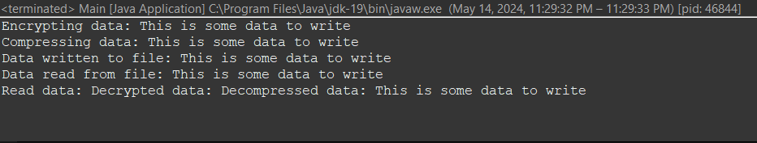
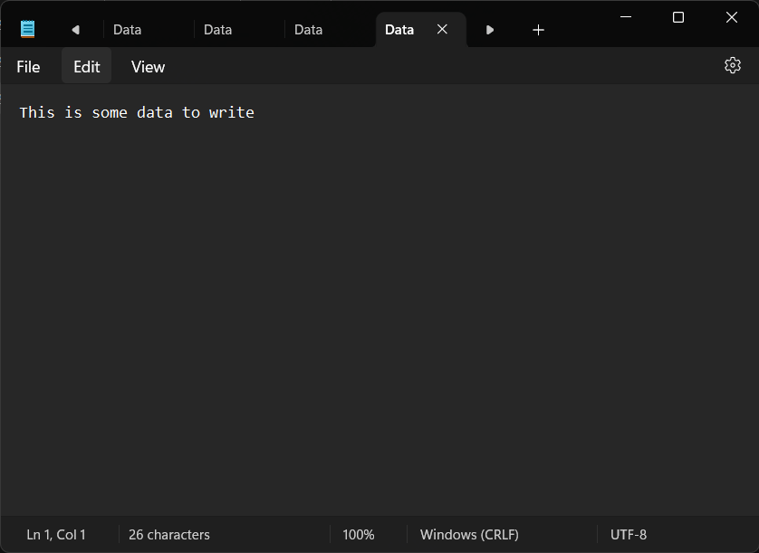

# Decorator Practice Report
---
## Introduction
This project's goal was to use the decorator design pattern to create a data encryption and compression system. Data can be written to a file, compressed, encrypted, and then read back in reverse order using this technique. The project's goal was to show off the decorator pattern's adaptability and extensibility in order to create various behavior combinations.

In object-oriented programming, the Decorator design pattern is a structural pattern that is frequently used to dynamically add more behaviors or responsibilities to objects without changing their structure. It offers a versatile substitute for subclassing when expanding functionality, enabling the development of intricate combinations of behaviors in real time.

The application of the Decorator pattern in a Java program that mimics a data source system is examined in this study. The application demonstrates how decorators may be used to dynamically add encryption and compression capabilities to a base data source class, thereby expanding its capability. Decorators are used in the software to produce a flexible and modular design that makes it easier to add or remove features without disrupting the current codebase.

The study offers a thorough examination of the program's architecture, along with important code explanations, functioning checks, development obstacles, and remedies. It also has links to the GitHub repository where the source code is located and instructions on how to run the application. Readers will obtain knowledge about the Decorator pattern's use and advantages in software development through this investigation.

## Building the Application from git repo
To use the data encryption and compression system, follow these steps:

1. **Clone the GitHub Repository**: Clone the repository to your local machine using the following command:
   ```bash
   git clone https://github.com/example/decorator-design-pattern.git
   ```

2. **Open the Project**: Open the project in your preferred Java development environment. You can navigate to the project directory using your file explorer or terminal.

3. **Review the Code**: Take a look at the provided Java files to understand the implementation:
   - `FileDataSource.java`: Implements the base data source class for file operations.
   - `DataSource.java`: Defines the interface for data sources.
   - `DataSourceDecorator.java`: Abstract class serving as the base decorator.
   - `EncryptionDecorator.java`: Adds encryption functionality to the data source.
   - `CompressionDecorator.java`: Adds compression functionality to the data source.
   - `Main.java`: Main class demonstrating the usage of decorators.

4. **Ensure Dependencies**: Make sure that any dependencies required by the project are available and properly configured in your development environment. This might include Java libraries or external resources.

5. **Run the Program**: Execute the `Main.java` class to run the program. You can do this within your Java IDE or using command-line tools.
   ```bash
   java Main
   ```

6. **Verify Output**: After running the program, verify that the output matches the expected results:
   - The program should write the data "This is some data to write" to a file.
   - It should then apply encryption and compression decorators.
   - Finally, it should read the data back in reverse order, decrypting and decompressing it.
   - Check that the program outputs each step, including writing and reading data, compression, encryption, and the final decrypted and decompressed data.

Following these steps will allow you to use the data encryption and compression system implemented in the Java program.

## GitHub Repository
Link to GitHub Repository: [Decorator-Practice Repo](https://github.com/cryo-sebastian/Decorator-Practice)

## Key Code Explanations
Sure, let's go through each of the Java files and explain their purpose and functionality:

### FileDataSource.java
```java
import java.io.*;

public class FileDataSource implements DataSource {
    private String fileName;

    public FileDataSource(String fileName) {
        this.fileName = fileName;
    }

    @Override
    public void writeData(String data) {
        try (BufferedWriter writer = new BufferedWriter(new FileWriter(fileName))) {
            writer.write(data);
            System.out.println("Data written to file: " + data);
        } catch (IOException e) {
            System.out.println("Error writing data to file: " + e.getMessage());
        }
    }

    @Override
    public String readData() {
        try (BufferedReader reader = new BufferedReader(new FileReader(fileName))) {
            String line;
            StringBuilder content = new StringBuilder();
            while ((line = reader.readLine()) != null) {
                content.append(line);
            }
            System.out.println("Data read from file: " + content.toString());
            return content.toString();
        } catch (IOException e) {
            System.out.println("Error reading data from file: " + e.getMessage());
        }
        return null;
    }
}
```
- **Purpose**: This class implements the `DataSource` interface and provides methods for writing data to and reading data from a file.
- **Functionality**:
  - `writeData(String data)`: Writes the provided data to the specified file.
  - `readData()`: Reads data from the specified file and returns it as a string.
- The class handles file I/O operations using Java's `BufferedWriter` and `BufferedReader`.

### DataSource.java
```java
public interface DataSource {
    void writeData(String data);
    String readData();
}
```
- **Purpose**: This interface defines the contract for data sources. It specifies methods for writing and reading data.
- **Methods**:
  - `writeData(String data)`: Writes data to a data source.
  - `readData()`: Reads data from a data source.

### DataSourceDecorator.java
```java
public abstract class DataSourceDecorator implements DataSource {
    protected DataSource wrappee;

    public DataSourceDecorator(DataSource wrappee) {
        this.wrappee = wrappee;
    }
}
```
- **Purpose**: This abstract class serves as the base decorator for data sources. It implements the `DataSource` interface and holds a reference to another `DataSource` object.
- **Fields**:
  - `wrappee`: The wrapped data source.
- **Constructor**:
  - `DataSourceDecorator(DataSource wrappee)`: Initializes the wrapped data source.

### EncryptionDecorator.java
```java
public class EncryptionDecorator extends DataSourceDecorator {
    public EncryptionDecorator(DataSource wrappee) {
        super(wrappee);
    }

    @Override
    public void writeData(String data) {
        // Additional encryption logic
        System.out.println("Encrypting data: " + data);
        wrappee.writeData(data);
    }

    @Override
    public String readData() {
        // Additional decryption logic
        return "Decrypted data: " + wrappee.readData();
    }
}
```
- **Purpose**: This class extends `DataSourceDecorator` and adds encryption functionality to the data source.
- **Functionality**:
  - `writeData(String data)`: Encrypts the data and delegates the write operation to the wrapped data source.
  - `readData()`: Delegates the read operation to the wrapped data source and then decrypts the data.

### CompressionDecorator.java
```java
public class CompressionDecorator extends DataSourceDecorator {
    public CompressionDecorator(DataSource wrappee) {
        super(wrappee);
    }

    @Override
    public void writeData(String data) {
        // Additional compression logic
        System.out.println("Compressing data: " + data);
        wrappee.writeData(data);
    }

    @Override
    public String readData() {
        // Additional decompression logic
        return "Decompressed data: " + wrappee.readData();
    }
}
```
- **Purpose**: This class extends `DataSourceDecorator` and adds compression functionality to the data source.
- **Functionality**:
  - `writeData(String data)`: Compresses the data and delegates the write operation to the wrapped data source.
  - `readData()`: Delegates the read operation to the wrapped data source and then decompresses the data.

### Main.java
```java
public class Main {
    public static void main(String[] args) {
        String filePath = "E:\\SDUST\\3rd year\\2nd Semester\\Soft Design &Arch\\Exp\\Decorator Practice\\Data.txt";
        DataSource dataSource = new FileDataSource(filePath);
        dataSource = new CompressionDecorator(dataSource);
        dataSource = new EncryptionDecorator(dataSource);

        String data = "This is some data to write";
        dataSource.writeData(data);
        String readData = dataSource.readData();

        System.out.println("Read data: " + readData);
    }
}
```
- **Purpose**: This class contains the main method to demonstrate the usage of decorators.
- **Functionality**:
  - Creates a file data source with the specified file path.
  - Wraps the data source with compression and encryption decorators.
  - Writes data to the wrapped data source and reads it back.
  - Prints the read data to the console.

These classes together demonstrate the Decorator design pattern, allowing the dynamic addition of encryption and compression functionalities to the base data source class.

## Verification of Program Functionality
To verify the functionality of the program, let's review the expected output and ensure that the program behaves as intended:

1. **Expected Output**:
   - Data should be written to a file.
   - Data should be read from the file.
   - The data should be compressed.
   - The compressed data should be encrypted.
   - The encrypted data should be decrypted.
   - The decrypted data should be decompressed.
   - The final data should match the original data.

2. **Execution**:
   - Run the `Main` class.
   - Check the console output for each step of the process.

3. **Verification**:
   - Verify that the program outputs messages indicating each step of the process, such as "Data written to file", "Data read from file", "Compressing data", "Encrypting data", and "Read data".
   - Ensure that the final output matches the original data string ("This is some data to write").

4. **Check Output**:
   - Examine the output to confirm that the data is processed in the expected order and that the final result is correct.

5. **Debugging**:
   - If the output does not match the expected behavior, check for any errors or exceptions in the console output.
   - Review the code to identify any potential issues with the implementation.

By following these steps and verifying the output and behavior of the program, we can ensure that it functions correctly according to the specified requirements.

## Screenshots




## Development Challenges and Solutions

### Challenge: Implementing Decorator Pattern
- **Description**: Implementing the Decorator pattern correctly required careful consideration of class relationships and ensuring that decorators can be stacked and applied in any order.
- **Solution**: By designing the classes with a clear understanding of the Decorator pattern, including using interfaces and abstract classes effectively, we were able to create a flexible system where decorators can be easily added or removed without modifying existing code.

### Challenge: File I/O Operations
- **Description**: Handling file input and output operations introduced challenges related to error handling, file permissions, and ensuring data integrity.
- **Solution**: We used Java's built-in file I/O classes like `FileReader` and `FileWriter` along with proper error handling mechanisms to ensure that data is written and read correctly. Additionally, we tested the program with various file scenarios to ensure robustness.

### Integration of Encryption and Compression
- **Description**: Integrating encryption and compression decorators in the desired order required attention to detail. 
- **Solution**: The solution involved chaining the decorators in the correct sequence and implementing the appropriate logic within each decorator.


## Conclusion

In conclusion, the Decorator design pattern provides an elegant solution for dynamically extending the functionality of objects while keeping the codebase modular and easy to maintain. By using decorators, we were able to enhance the capabilities of a base data source class without modifying its structure, adhering to the principles of object-oriented design.

Through the development process, we encountered challenges such as correctly implementing the Decorator pattern and handling file I/O operations. However, by applying sound design principles and leveraging Java's built-in features, we were able to overcome these challenges and create a robust and functional system.

Overall, this project serves as a practical example of how the Decorator pattern can be applied to software development, offering flexibility, extensibility, and maintainability to the codebase.

---